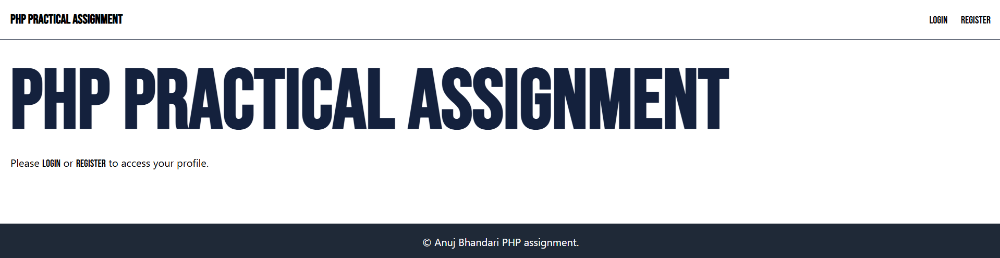
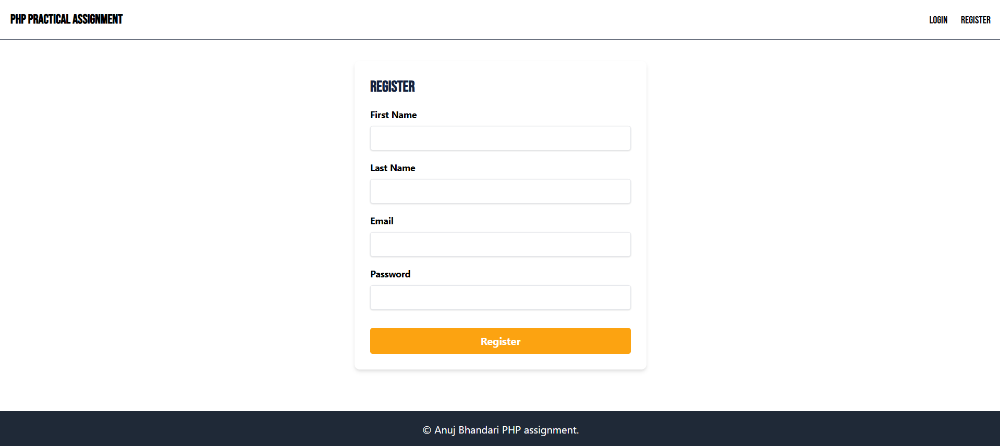
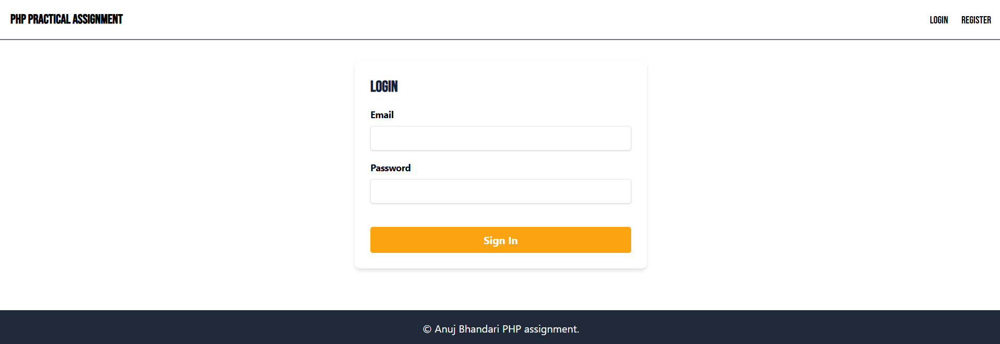
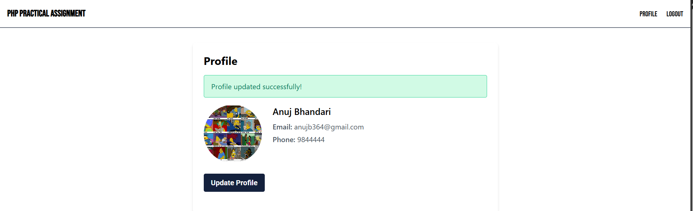
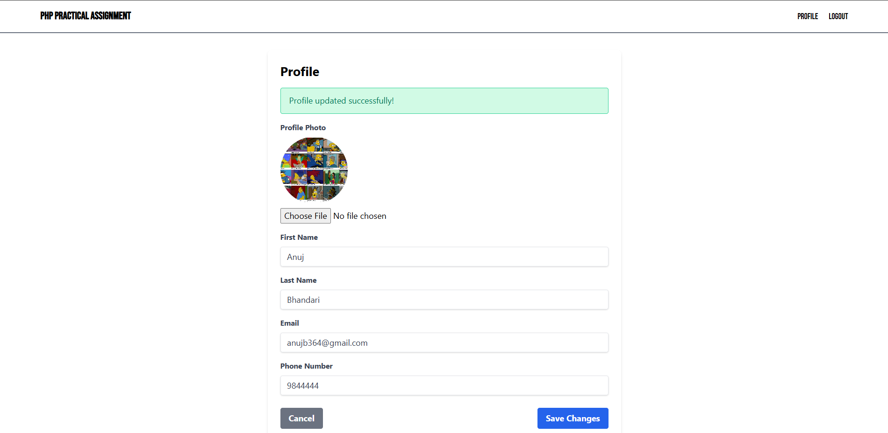

# Practical PHP Assignment

This is a practical PHP assignment project that implements a user profile system. The project allows users to register, log in, update their profile information, and upload a profile photo.

## Project Structure

config.php
index.php
login.php
logout.php
partials/
footer.php
header.php
profile.php
register.php
uploads/
...
views/
login.view.php
profile.view.php
register.view.php

## Features

- User Registration
- User Login
- User Logout
- Profile Update
- Profile Photo Upload

## Setup

1. Clone the repository:

   ```sh
   git clone https://github.com/anuz505/PHP-practical-CRUD.git
   cd practical-php-assignment
   ```

2. Configure the database connection in [config.php]:

   ```php
   $host = 'localhost';
   $dbname = 'user_profiles';
   $username = 'root';
   $password = 'root';
   ```

3. Import the database schema:

   ```sql
   CREATE DATABASE user_profiles;
   USE user_profiles;

   CREATE TABLE users (
       id INT AUTO_INCREMENT PRIMARY KEY,
       first_name VARCHAR(255) NOT NULL,
       last_name VARCHAR(255) NOT NULL,
       email VARCHAR(255) NOT NULL UNIQUE,
       password VARCHAR(255) NOT NULL,
       phone VARCHAR(20),
       profile_photo VARCHAR(255)
   );
   ```

4. Start your local server and navigate to the project directory.

## Usage

- Visit [index.php] to see the homepage.
- Register a new user at [register.php].
- Log in with your credentials at [login.php].
- Update your profile at [profile.php].
- Log out at [logout.php].

## File Descriptions

- [config.php]: Contains database connection settings and starts the session.
- [index.php]: The homepage of the project.
- [login.php]: Handles user login.
- [logout.php]: Handles user logout.
- [profile.php]: Allows users to update their profile information.
- [register.php]: Handles user registration.
- [header.php]: Contains the header HTML code.
- [footer.php]: Contains the footer HTML code.
- [login.view.php]: The login view.
- [profile.view.php]: The profile view.
- [register.view.php]: The registration view.

## Screenshots

Here are some screenshots of the project:

- **Homepage**:
  

- **User Registration**:
  

- **User Login**:
  

- **User Profile**:
  

- **Profile Update**:
  

Happy coding!
